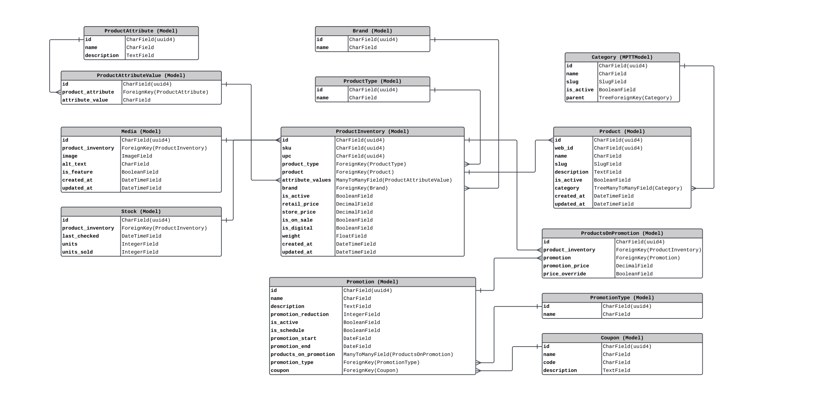

# **Django-Ecommerce**

### **Overview:**

This Django-based E-commerce project is designed to offer a robust and scalable solution for online retail businesses. Leveraging Django's powerful framework, along with PostgreSQL database management system and Docker for containerization, this project provides a comprehensive platform for managing various aspects of an online store.

### **Key Features:**

1. **Advanced Database Design:** The project implements a complex and optimized database schema using PostgreSQL, ensuring efficient data storage and retrieval.

2. **Dockerized Environment:** Docker containers are utilized to encapsulate the entire application stack, including Django, PostgreSQL, pgAdmin, Elasticsearch, Celery, Flower, and Celery Beat. This facilitates easy deployment and scalability.

3. **Elasticsearch Integration:** Elasticsearch is integrated to provide fast and accurate search functionality for products, enabling users to quickly find desired items.

4. **Celery for Asynchronous Task Processing:** Celery is employed for handling asynchronous tasks such as order processing, email notifications, and other background jobs, enhancing system responsiveness and scalability.

5. **Admin Panel with pgAdmin:** pgAdmin is included for efficient management of the PostgreSQL database, allowing administrators to perform various database-related tasks with ease.

6. **RESTful API with Swagger Documentation:** The project provides a RESTful API powered by Django REST Framework, enabling seamless integration with third-party services and client applications. Swagger API documentation ensures clear and comprehensive API reference.

7. **JWT Authentication:** JSON Web Token (JWT) authentication is implemented to secure API endpoints, providing a stateless and scalable authentication mechanism.

### **Models:**

1. **Dashboard App**

    - User (Custom User Model)

2. **Inventory**

    - Category
    - Product
    - ProductType
    - Brand
    - ProductAttribute
    - ProductAttributeValue
    - ProductInventory
    - Media
    - Stock

3. **Promotion**

    - PromotionType
    - Coupon
    - Promotion
    - ProductsOnPromotion

### **Database Design**

### **Python Packages Used**

-   Django
-   Django Bootstrap5
-   Django CORS Headers
-   Django Elasticsearch
-   Django MPTT
-   Django REST Framework
-   Djagno REST Framework - Simple JWT
-   DRF - yasg (Swagger UI)
-   Faker
-   Pytest
-   Celery
-   Django Lint (djLint)
-   Psycopg2 (psycopg2-binary)
-   Redis
-   Selenium
-   WhiteNoise

### **Technologies Used**

-   Docker
    -   Celery
    -   Postgres Database
    -   PgAdmin
    -   Celery Beat
    -   Flower
